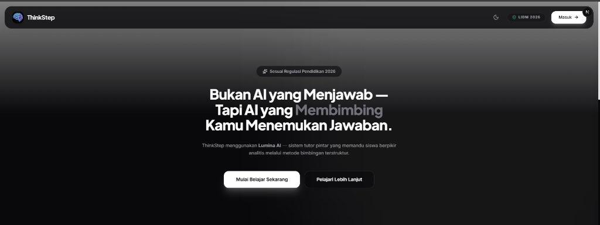
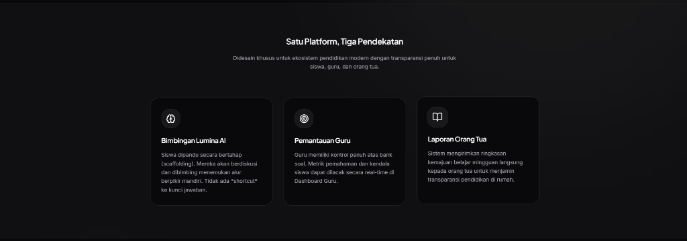
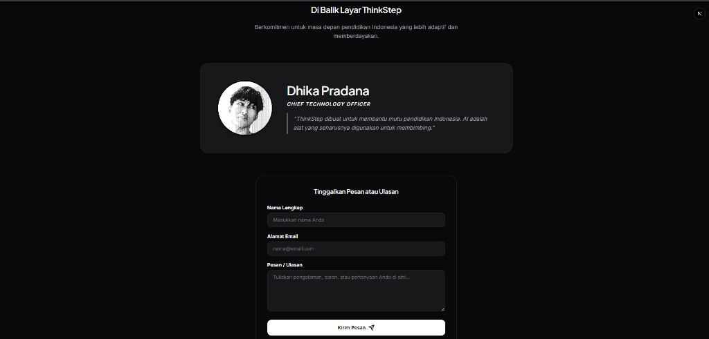
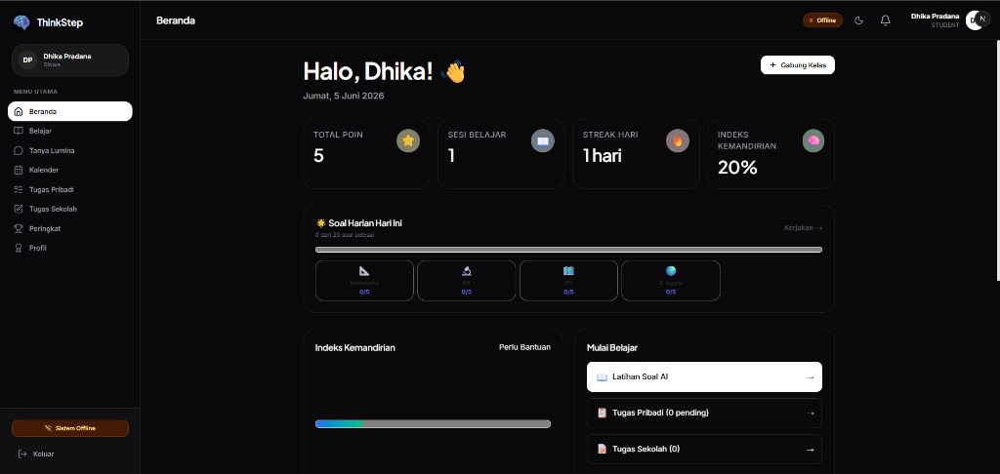
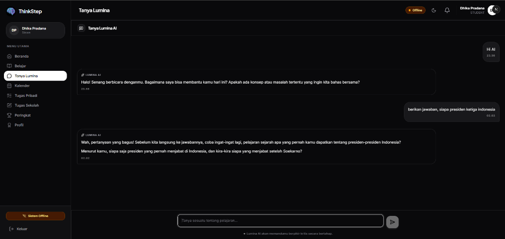
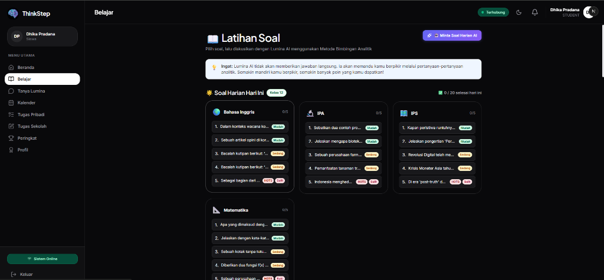
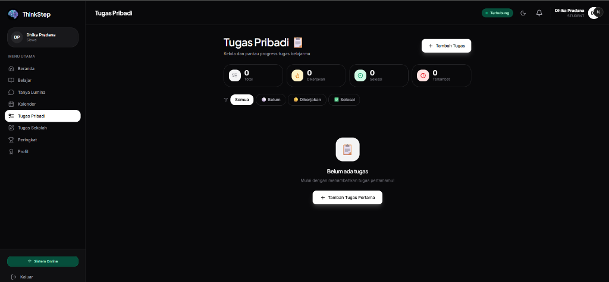
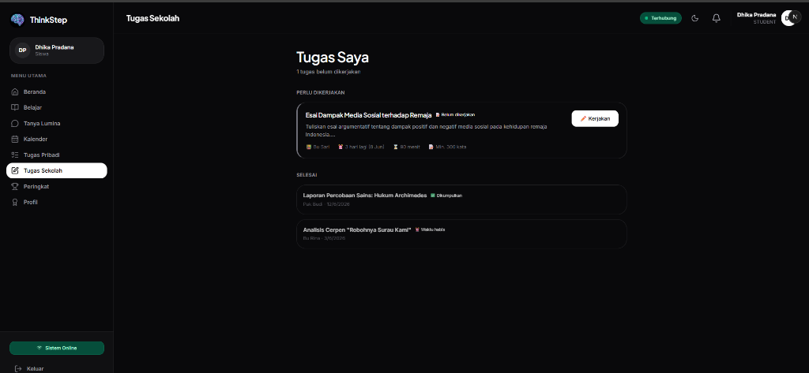

<div align="center">
<pre style="font-family: monospace, Courier, 'Courier New'; font-size: 10px; font-weight: bold; line-height: 1.2;">


.....................................................................................*@@%.........................
...................................................................................+@@@@@:........................
..........................................                .......................-@@@@@%:.........................
....................................... ... .. ....    ........................:%@@@@%-...........................
..................................                              ..............*@@@@@*.............................
..................................                               ...........=@@@@@#...............................
................................                               ...........:%@@@@%:................................
...............................                                 ... .....#@@@@@=..................................
.............................              .....-=====================+#@@@@@*....................................
............................ ... ..      ...:@@@@@@@@@@@@@@@@@@@@@@@@@@@@@@%......................................
...........................       .... ...:%@@@@@@@@@@@@@@@@@@@@@@@@@@@@%+:.......................................
...........................          .. .=@@@@@*..................................................................
...........................            .-@@@@#.. .     ........        ...........................................
..........................             .+@@@@..      ...@@@@*..        ...........................................
...............................  .............  ......:@@@@@......................................................
..............................:-====================+@@@@@@-.           ..........................................
...........................=@@@@@@@@@@@@@@@@@@@@@@@@@@@@@*...           ..........................................
.........................=@@@@@@@@@@@@@@@@@@@@@@@@@@@@#+..             ...........................................
........................+@@@@@-...                .....                ...........................................
.......................-@@@@+.....................................................................................
.......................%@@@*..........*@@@@-. ....................   .............................................
............................... . ...=@@@@#.                        ..............................................
...........:-----------:------::---*@@@@@#........................................................................
.........-@@@@@@@@@@@@@@@@@@@@@@@@@@@@@@=.                       .................................................
.........:%@@@@@@@@@@@@@@@@@@@@@@@@@@#-.... ............  ........................................................
..................................................................................................................
............................................            ..........................................................
...............................................     ..............................................................
..................................................................................................................
..................................................................................................................
..................................................................................................................
..................................................................................................................
     
</pre>
  <h1>ThinkStep — AI yang Membimbing, Bukan Sekadar Menjawab</h1>
  <p><em>Platform pendidikan berbasis AI modern yang dirancang khusus untuk memandu pemikiran analitis siswa sesuai standar Kurikulum Merdeka 2026.</em></p>
</div>

---

## 🎯 Apa Itu ThinkStep?

Pernahkah Anda menyadari bahwa AI saat ini sering membuat siswa malas berpikir karena langsung memberikan jawaban akhir? 

**ThinkStep hadir untuk mengubah itu.** 

ThinkStep adalah platform pembelajaran revolusioner yang didukung oleh **Lumina AI**. Alih-alih memberikan jawaban instan (yang membuat otak "tumpul"), Lumina AI diprogram secara khusus menggunakan *Socratic Method* (Metode Socrates) untuk **menjadi tutor pribadimu**. Lumina akan memberikan petunjuk bertahap, menanyakan pertanyaan pancingan, dan membimbing siswa langkah demi langkah hingga mereka **menemukan jawabannya sendiri**. 

Konsep ini dirancang agar sejalan dengan *SKB 7 Menteri 2026* tentang pemanfaatan AI yang sehat di dunia pendidikan Indonesia.

---

## ✨ Fitur Unggulan

Kami membawa ekosistem belajar yang komprehensif, tidak hanya untuk siswa, tapi juga bagi guru dan orang tua:

*   🤖 **Lumina AI Tutor (Socratic Engine)** 
    *   Tidak memberi jawaban instan. AI ini akan memberikan *hint* berjenjang (dari petunjuk ringan hingga sangat spesifik) sesuai dengan tingkat kesulitan siswa.
    *   Siswa bisa berdiskusi langsung, mengirim foto soal matematika/sains, dan AI akan membacanya!
*   📶 **Teknologi Hybrid (Online & Offline Mode)**
    *   Bisa berjalan dengan API cloud yang sangat cerdas saat ada internet.
    *   **Kehabisan kuota? Tidak masalah!** Sistem otomatis berpindah ke AI lokal yang berjalan 100% tanpa internet, cocok untuk daerah 3T.
*   🎮 **Gamifikasi & *Autonomy Index***
    *   Setiap kali siswa berhasil menjawab dengan *hint* paling sedikit, mereka akan mendapatkan poin dan **Lencana (Badges)** yang keren!
    *   Fitur ***Autonomy Index*** mengukur seberapa mandiri seorang siswa dalam memecahkan masalah.
*   👩‍🏫 **Dashboard Guru yang Super Analitis**
    *   Guru tidak lagi menebak-nebak siapa yang mencontek. Dashboard guru menampilkan grafik performa, rata-rata *hint* yang dipakai per siswa, hingga materi apa yang paling banyak ditanyakan ke AI.
    *   Guru bisa meng-generate soal harian secara otomatis pakai AI!
*   👨‍👩‍👦 **Notifikasi Orang Tua Mingguan**
    *   Sistem secara otomatis akan mengirimkan laporan perkembangan belajar, waktu belajar, dan indeks kemandirian anak langsung ke email orang tua setiap minggu.
*   📱 **Desain *Mobile-First* & Sangat Elegan**
    *   Tampilan antarmuka yang sangat modern, mendukung *Dark Mode* & *Light Mode* dinamis, serta 100% responsif dibuka dari HP sekecil apapun.

---

## 📸 Tampilan Antarmuka (Screenshots)

Berikut adalah dokumentasi tampilan dari dalam aplikasi ThinkStep:

**1. Halaman Utama (Landing Page) — Hero Section**
Tampilan perkenalan metode Socratic AI kepada pengguna publik.


**2. Halaman Utama (Landing Page) — Fitur Unggulan**
Penjelasan tentang bimbingan Lumina AI, pemantauan guru, dan laporan untuk orang tua.


**3. Halaman Utama (Landing Page) — Profil Pembuat & Kontak**
Biodata pembuat aplikasi dan formulir ulasan kontak.


**4. Dashboard Siswa (Beranda)**
Menampilkan statistik belajar, poin, indeks kemandirian, dan streak belajar harian.


**5. Tanya Lumina (Chat AI Tutor)**
Lumina AI menggunakan *Socratic Method* untuk membimbing siswa menjawab pertanyaan tanpa memberikan jawaban langsung.


**6. Latihan Soal AI**
Latihan soal pilihan ganda dari berbagai mata pelajaran (Matematika, IPA, IPS, B. Inggris).


**7. Manajemen Tugas Pribadi**
Siswa dapat mencatat dan memonitor *progress* tugas-tugas personal mereka di luar tugas sekolah.


**8. Tugas Sekolah**
Integrasi tugas resmi yang diberikan oleh guru pengajar langsung di dalam platform.


---

## 🚀 Cara Instalasi (Sangat Mudah!)

Lupakan pengaturan database yang rumit, install dependency manual, atau konfigurasi AI yang bikin pusing. Kami telah merancang **Skrip Instalasi 1-Klik** agar siapapun (bahkan yang bukan programmer) bisa menjalankan ThinkStep di komputernya!

### Langkah 1: Unduh Repositori
```bash
git clone https://github.com/DhikaPradanaaa/ThinkStep.git
cd ThinkStep/thinkstep-app
```

### Langkah 2: Jalankan Skrip Ajaib Kami 🪄

**Bagi Pengguna Windows:**
Buka folder `thinkstep-app` di File Explorer, lalu **klik dua kali (double-click)** pada file bernama:
👉 `install-offline.bat`

**Bagi Pengguna macOS / Linux:**
Buka terminal di dalam folder tersebut dan jalankan:
👉 `bash install-offline.sh`

### Selesai! Tunggu Sambil Minum Kopi ☕
Hanya dengan 1 klik itu, skrip kami akan melakukan *magic* di latar belakang:
1. Mengunduh semua pustaka (libraries) yang dibutuhkan.
2. Membuat kunci rahasia (*Environment Variables*) secara otomatis.
3. Menyiapkan dan mengisi database dengan data percontohan (Siswa, Guru, Soal).
4. **Otomatis mengunduh AI Lokal (Ollama & Model Qwen)** agar web ini bisa dipakai meski Wi-Fi dimatikan!
5. Otomatis membuka aplikasi di browser Anda (`http://localhost:3000`).

---

## 🛡️ Keamanan Standar Industri
Aplikasi ini tidak hanya cantik, tapi juga tahan banting! Telah melewati *Full Security Audit*:
*   Proteksi SQL/NoSQL Injection & XSS.
*   Validasi *MIME type & Magic Bytes* super ketat untuk unggah foto soal.
*   Enkripsi *Bcrypt* untuk password.
*   Rate limiting & Proteksi endpoint CRON.

---
<div align="center">
  <b>ThinkStep — Diciptakan untuk memajukan mutu pendidikan Indonesia.</b>
</div>
